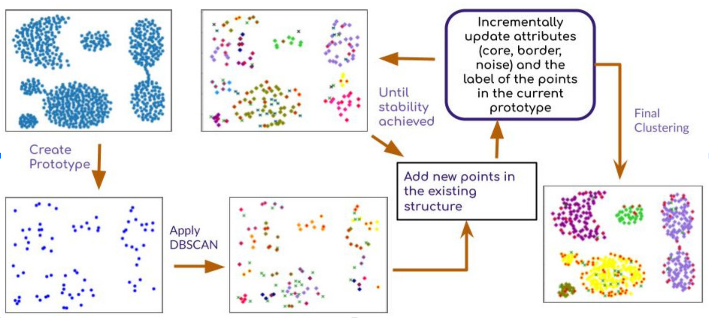
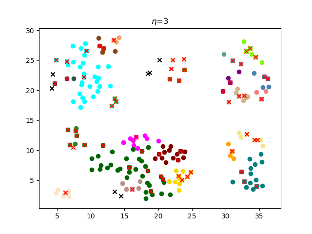

# Incremental Prototype-based DBSCAN (IPD)

##  🔍 Overview 
DBSCAN is a popular density-based clustering method known for its ability to detect clusters of diverse shapes. However, its performance significantly degrades when dealing with large-scale datasets due to challenges in label storage and processing. On the other hand, centroid-based methods like K-means are efficient for large datasets but struggle with identifying non-spherical clusters.


## 💡 Our Solution

The **Incremental Prototype-based DBSCAN (IPD)** algorithm combines the strengths of these different clustering approaches. IPD is designed to handle large datasets effectively while identifying clusters of arbitrary shapes. It begins by forming initial clusters using DBSCAN on a small prototype and incrementally adds new data points, establishing a scalable clustering process.

## 🚀✨ Key Features

-   **Prototype-Based Clustering**: IPD creates a prototype using a sample dataset, which is then expanded to include all patterns from the entire dataset.
-   **Cluster Representatives**: The algorithm selects core points as representatives for each cluster, ensuring reasonable boundary detection.
-   **Stability Criterion**: A well-defined stopping criterion is used for early termination to ensure efficiency, even with very large datasets.

##  Schematic Diagram

## Results 
Our experimental analysis demonstrates that IPD achieves **perfect convergence and scalability** especially on large synthetic datasets containing complex shaped clusters.



## 🎉 Exciting News!

We are thrilled to announce that our paper titled "**IPD: Scalable Clustering with Incremental Prototypes**" has been **accepted for publication**! 🚀✨ 

This acceptance is a recognition of our efforts in developing a scalable and accurate clustering approach for large datasets. 

Stay tuned for more updates, and you can read the preprint [https://arxiv.org/abs/2202.07870](LINK_TO_YOUR_PAPER). 

Thank you for your support!


## 📑 Citation

If you use our work, please cite:


```bibtex
@inproceedings{saha2024ipd, 
title={IPD: Scalable Clustering with Incremental Prototypes}, 
author={Jayasree Saha and Jayanta Mukhopadhyay}, 
booktitle={ICPR-2024}, 
year={2024}, 
 }

